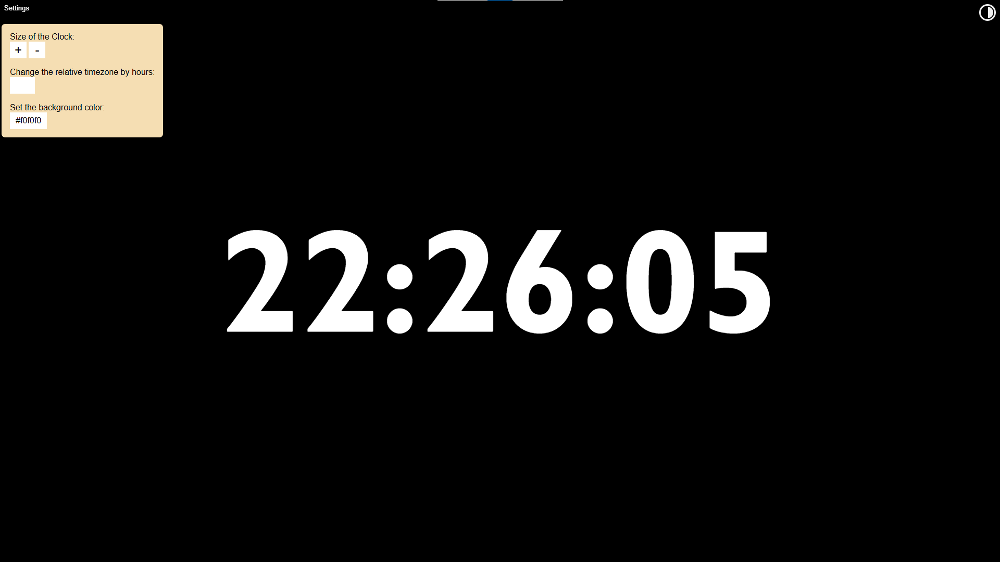

## Time Website

### Description

I developed a simple time website if someone ever needs to display the time on a large screen. This could be used for example in class test for the students to know how much time they got left of in some sort of challenges where time plays an important role.

### Preview

Thats the project on first sight.

But its also possible to modify it a bit using the settings menu or the dark-mode toggle on the top right.

### Usage

This project can be hosted by any static web-hosting service by just dragging the files into the right directory.
